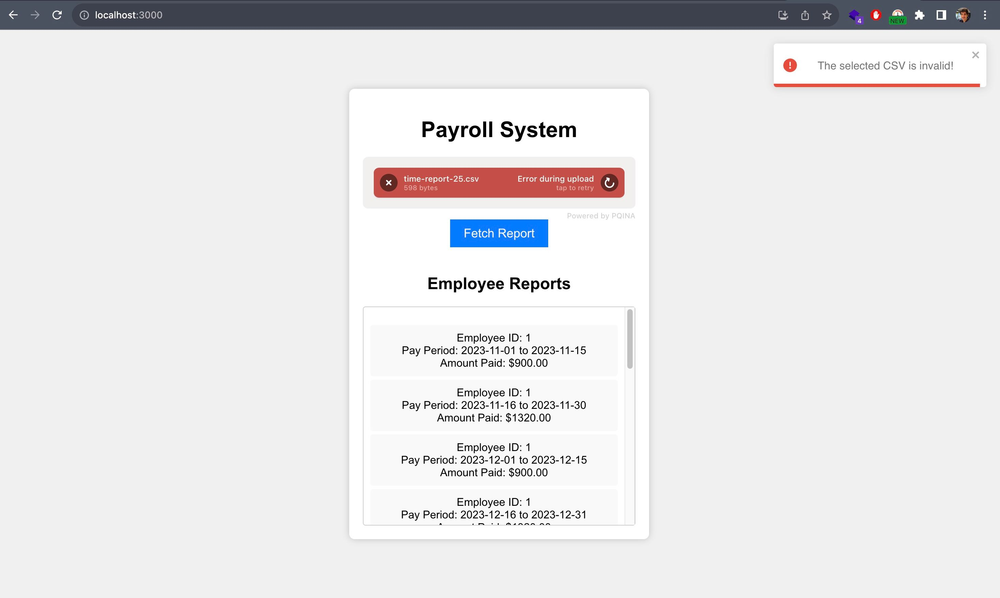

# Payroll System
A payroll system for Wave software development challenge. The backend is coded with `Kotlin` in the `Spring Boot` framework, by use of `MySQL` database. The front end is based on `React`.  

## Configuring MySQL
A MySQL database is needed for running the backend. Please install MySQL, open its shell using `mysql -u root -p`, and then create a database named _wave_payroll_ using `create database wave_payroll` command.
Then edit the _application.properties_ file to set the correct username and password for accessing the MySQL.

## Running the backend
### Using IntelliJ
1. Clone/Open the project in IntelliJ.
2. Right click on _pom.xml_ file in the _backend_ folder and select _Import as a Maven Project_.
3. Open the _PayrollApplication.kt_ and run it to start the server.
4. The server will run on _http://localhost:8080_

### Using terminal
1. Open the terminal, and go to the _backend_ directory using `cd backend`.
2. Build the backend and create a jar file using `mvn package`.
3. Go to the target directory using `cd target`
4. Run the jar file using `java -jar payroll-0.0.1.jar`.
5. The server will run on _http://localhost:8080_

## Running the front end from terminal
1. Open the terminal, and go to the _frontend_ directory using `cd frontend`.
2. Install the packages using `npm install`.
3. Run the React application using `npm run`.
4. The React will run on _http://localhost:3000_



## APIs
### The API for uploading a new csv file
```
POST http://localhost:8080/api/upload?file=<MultipartFile>
```

### The API for getting a report
```
GET http://localhost:8080/api/report
```

## Answers to Questions
### 1. How did you test that your implementation was correct? 
I used the sample csv file and developed a set of test cases to ensure that the implementation is working correctly. I also tried to test the exceptional states in the system.  

### 2. If this application was destined for a production environment, what would you add or change?
For using the application for a production environment, the report API should support some filters to have more useful results.

### 3. What compromises did you have to make as a result of the time constraints of this challenge?
I would develop more boundary tests. I would add the currency unit to job groups, so we can support multiple countries. The UI is minimal but functional. I would have spent more time making it more beautiful.